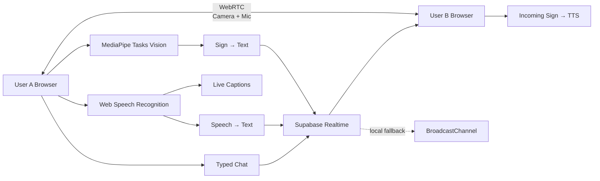

# 🤟 **SignVoice**

### **Real-Time Sign + Speech Communication for Two-Person Video Meetings**

[](https://react.dev/)
[](https://vite.dev/)
[](https://developer.mozilla.org/en-US/docs/Web/API/WebRTC_API)
[](https://supabase.com/docs/guides/realtime)
[](https://developers.google.com/mediapipe)
[](LICENSE)

> **SignVoice combines a live two-person video call with sign-language recognition, speech-to-text, text chat, live captions, and text-to-speech — all inside the same meeting experience.**

**Live demo:** https://sign-voice-neon.vercel.app  
**Repository:** https://github.com/anshulmaletha/SignVoice-Async


## 🖼️ **Product Screenshots**

### **1. Landing Page**
<p align="center">
  
</p>

### **2. Login / Authentication**
<p align="center">
  
</p>

### **3. Live Sign + Speech Workspace**
<p align="center">
  
</p>

> **The three screenshots above are intentionally rendered at the same compact size so the README stays clean and easy to scan.**

---

# 📚 **Table of Contents**

1. [Context & Value Proposition](#1--context--value-proposition)
2. [🔥 Product Highlights](#2--product-highlights)
3. [🤟 Gesture Communication](#3--gesture-communication)
4. [📹 Two-Person Meeting System](#4--two-person-meeting-system)
5. [🏗️ Architecture & System Design](#5--architecture--system-design)
6. [🔄 End-to-End Execution Flow](#6--end-to-end-execution-flow)
7. [💬 Communication Pipeline](#7--communication-pipeline)
8. [⚙️ Installation & Configuration](#8--installation--configuration)
9. [🔐 Environment Variables](#9--environment-variables)
10. [💻 Usage](#10--usage)
11. [🧪 Testing & QA](#11--testing--qa)
12. [⚡ Reliability, Performance & Maturity](#12--reliability-performance--maturity)
13. [🧩 Troubleshooting & Known Limitations](#13--troubleshooting--known-limitations)
14. [🔒 Security](#14--security)
15. [📁 Repository Structure](#15--repository-structure)
16. [🚀 Deployment](#16--deployment)
17. [🔧 Developer Workflow](#17--developer-workflow)
18. [🤝 Governance, Contribution & License](#18--governance-contribution--license)
19. [🔗 References](#19--references)

---

# 1. 🎯 **Context & Value Proposition**

## The problem

Traditional video calls assume that both participants can communicate naturally through **speech** or **typing**. That becomes limiting when one participant communicates primarily through **sign language**.

## The SignVoice approach

SignVoice puts **multiple communication modes inside one live conversation**:

- **Live camera + microphone** for the actual two-person call.
- **Gesture recognition** from the camera feed for sign-based communication.
- **Sign → Text** so recognized gestures become readable conversation messages.
- **Incoming Sign → Speech (TTS)** so a receiving participant can hear a signed message.
- **Speech → Text** for live captions and speech messages.
- **Typed chat** as a universal fallback.
- **One unified conversation feed** combining sign, speech, and text messages chronologically.

### **Value proposition**

> **Connect → Sign → Speak → Read → Listen → Understand**

The communication experience is designed around the **meeting itself**, rather than forcing users to switch between separate tools.

### Target users

- **Signing + speaking pairs** communicating remotely.
- Users who need **captions or text support** during a video conversation.
- Users who want a **simple shareable meeting link** without a separate meeting platform.
- Hackathon/demo users exploring **accessible multimodal communication**.

---

# 2. 🔥 **Product Highlights**

| Capability | What it does |
|---|---|
| 📹 **Two-Person Video Call** | **Live camera + microphone** communication using native WebRTC. |
| 🤟 **Gesture-Powered Communication** | Use the **camera during the call** to detect supported signs and send them to the other participant. |
| 📝 **Sign → Text** | Recognized gestures become **readable messages** in the conversation feed. |
| 🔊 **Sign → Speech** | An incoming recognized sign can be **spoken aloud automatically** using browser TTS. |
| 🎙️ **Speech → Text** | Spoken words become **live captions + final text messages**. |
| 💬 **Text Chat** | Two participants can exchange typed messages in the same room. |
| 🧾 **Unified Conversation Feed** | **Signs, speech, and chat** are shown in one chronological feed with `You` / `Friend` labels. |
| 🔗 **Shareable Meeting Link** | Create a unique `SV-XXXXXX` room and send one link to the second participant. |
| 🎛️ **In-Call Controls** | **Camera, microphone, and speech recognition** can be toggled during the meeting. |
| 🚪 **Clean Leave / Rejoin** | Media tracks, signaling, and recognition loops are cleaned up when the call ends. |
| 📱 **Responsive Meeting UI** | Meeting controls and layouts adapt for narrow screens. |

> ### ⭐ **Most important feature**
> **SignVoice is not only a gesture recognizer. It is a complete two-person meeting where gestures become part of the live conversation.**

---

# 3. 🤟 **Gesture Communication**

## Gesture recognition flow

```text
Webcam
  ↓
MediaPipe Tasks Vision
  ↓
Hand landmarks / gesture recognition
  ↓
Custom gesture classifier
  ↓
15-frame stabilization / hold debounce
  ↓
Supported Sign
  ↓
Sign → Text message
  ↓
Supabase Realtime
  ↓
Friend receives the sign
  ↓
Incoming Sign → TTS (optional)
```

## Supported signs

| Gesture | Meaning |
|---|---|
| **HELLO** | Hello |
| **YES** | Yes |
| **NO** | No |
| **HELP** | Help |
| **THANK_YOU** | Thank you |
| **STOP** | Stop |
| **WAIT** | Wait |
| **WATER** | Water |
| **FOOD** | Food |
| **GOODBYE** | Goodbye |
| **PLEASE** | Please |
| **SORRY** | Sorry |

### Recognition behavior

- The local camera feed is processed continuously while sign recognition is enabled.
- **15 consecutive stable frames** are used for gesture stabilization before emitting a sign.
- Low-confidence predictions can be treated as `UNKNOWN` instead of being emitted as supported signs.
- The detected sign is shown directly on the local meeting UI.
- The remote participant sees a **`🤟 [Sign] Friend: ...`** conversation entry.
- **Only the receiving side triggers sign TTS**; your own outgoing sign does not speak back to you.

---

# 4. 📹 **Two-Person Meeting System**

## Meeting creation

A participant starts a meeting from the authenticated dashboard:

```text
Login
  ↓
Dashboard
  ↓
Start Meeting
  ↓
Generate SV-XXXXXX
  ↓
Open /meeting/SV-XXXXXX
  ↓
Copy meeting link
  ↓
Send to Friend
```

Example:

```text
https://your-domain.com/meeting/SV-7K4P2A
```

## Joining

The second participant opens **the same meeting URL**. The room supports **exactly two participants** for the MVP.

### Meeting behavior

- **WebRTC carries the actual camera video and microphone audio.**
- **Supabase Realtime carries signaling + presence**, not the media stream.
- Offer/answer negotiation uses a deterministic initiator.
- ICE candidates are exchanged through the signaling channel.
- Late joiners are supported through early-signal queuing and deterministic negotiation.
- A third participant is rejected with a **Meeting Room Full** state.
- Camera-off and microphone-muted states are propagated to the remote participant.

### Meeting controls

| Control | Behavior |
|---|---|
| 🎥 **Camera** | Enable/disable the local video track. |
| 🎙️ **Microphone** | Mute/unmute the local audio track. |
| 🗣️ **Speech** | Start/stop browser speech recognition. |
| 🤟 **Gesture** | Start/stop local gesture recognition when supported by the meeting UI. |
| 🔊 **TTS** | Control incoming sign-to-speech behavior. |
| 💬 **Chat** | Send typed messages. |
| 🚪 **Leave** | Tear down the call and return to the appropriate app view. |

---

# 5. 🏗️ **Architecture & System Design**

## High-level architecture



## Service boundaries

| Layer | Responsibility |
|---|---|
| **React + Vite** | UI, SPA routing, meeting state, controls, feed rendering. |
| **WebRTC** | **Actual peer-to-peer audio + video transport.** |
| **Supabase Realtime** | **Cross-device signaling and presence** via Broadcast + Presence. |
| **BroadcastChannel** | Local-development fallback for same-browser/local scenarios. |
| **MediaPipe Tasks Vision** | Browser-side gesture recognition. |
| **Custom Gesture Classifier** | Gesture mapping/classification from hand data. |
| **Web Speech API** | Browser-side speech recognition / transcription. |
| **SpeechSynthesis** | Incoming sign-to-speech playback. |

### Important architecture rule

> **Supabase is the signaling layer; WebRTC is the media layer.**
>
> **The audio/video stream does not pass through Supabase.**

## Key files

| File | Purpose |
|---|---|
| `src/components/meeting/MeetingRoom.jsx` | Main **live meeting UI and communication orchestration**. |
| `src/components/meeting/MeetingHeader.jsx` | Meeting identity, link actions, status, leave controls. |
| `src/services/webrtcManager.js` | **Native WebRTC peer connection** and media transport. |
| `src/services/webrtcSignaling.js` | **Supabase Broadcast/Presence signaling** + local fallback. |
| `src/services/supabaseClient.js` | Browser Supabase client configuration. |
| `src/services/sessionService.js` | Anonymous meeting session identity. |
| `src/speech/SpeechToText.js` | **Browser speech recognition lifecycle**, interim/final handling, and recovery. |
| `src/gesture/GestureRecognizer.js` | MediaPipe gesture recognition runtime. |
| `src/gesture/customGestureClassifier.js` | Custom gesture classification. |
| `src/audio/TextToSpeech.js` | Browser speech synthesis for incoming signs. |
| `src/services/conversationStore.js` | Conversation/session history persistence. |
| `src/utils/meetingId.js` | Meeting ID generation. |
| `vercel.json` | **SPA deep-link rewrite** for routes such as `/app` and `/meeting/:meetingId`. |

---

# 6. 🔄 **End-to-End Execution Flow**

```text
1. User A signs in
        ↓
2. Dashboard → Start Meeting
        ↓
3. Generate unique SV-XXXXXX meeting ID
        ↓
4. User A enters MeetingRoom
        ↓
5. Browser requests camera + microphone
        ↓
6. Supabase Realtime channel is joined
        ↓
7. Presence detects User B
        ↓
8. WebRTC Offer / Answer / ICE exchange
        ↓
9. Peer-to-peer camera + microphone become connected
        ↓
10. During the call:
      ├── Gesture → Sign → Text → Remote Feed
      ├── Incoming Sign → TTS
      ├── Speech → Live Caption → Final Text → Remote Feed
      └── Typed Chat → Remote Feed
        ↓
11. Leave / disconnect cleanup
```

## Browser route handling

The app uses client-side routing inside `src/App.jsx` and supports direct browser navigation for:

```text
/
/login
/app
/dashboard
/sign-speak
/sessions
/friends
/profile
/settings
/meeting/:meetingId
```

**`vercel.json` rewrites unknown client-side routes to `index.html`** so direct meeting links do not become Vercel `404 NOT_FOUND` pages.

---

# 7. 💬 **Communication Pipeline**

## Sign → Text

```text
Camera
 → GestureRecognizer
 → stabilized gesture
 → room signaling
 → remote conversation feed
```

## Sign → Speech

```text
Remote sign message
 → sign text
 → SpeechSynthesis
 → recipient hears the meaning
```

## Speech → Text

```text
Microphone
 → Browser SpeechRecognition
 → interim transcript
 → live caption
 → final transcript
 → room signaling
 → remote conversation feed
```

## Text Chat

```text
Typed message
 → validation
 → room signaling
 → chronological conversation feed
```

### Conversation model

Every incoming message is presented with a clear type and sender distinction:

```text
🤟 [Sign] Friend: HELLO
🗣️ [Speech] Friend: How are you?
💬 [Text] You: I am good.
```

---

# 8. ⚙️ **Installation & Configuration**

## Prerequisites

### Required

- **Node.js 20.x or newer**
- npm
- Git
- Modern browser with camera + microphone support
- **Chrome or Edge recommended** for the browser SpeechRecognition feature

### Runtime notes

- No Python runtime is required for the browser application.
- No dedicated GPU is required; MediaPipe and browser workloads run client-side.
- **HTTPS is required for production camera/microphone access.**

## Clone the repository

```bash
git clone https://github.com/anshulmaletha/SignVoice-Async.git
cd SignVoice-Async
git checkout integration
```

## Install dependencies

```bash
npm install
```

## Start local development

```bash
npm run dev
```

For two-device LAN testing:

```bash
npm run dev -- --host 0.0.0.0
```

Then open the Vite URL printed in the terminal.

## Production build

```bash
npm run build
```

## Preview the production build locally

```bash
npm run preview
```

---

# 9. 🔐 **Environment Variables**

Create a `.env` file in the repository root for local development.

| Variable | Type | Required | Default | Purpose |
|---|---|---:|---|---|
| `VITE_SUPABASE_URL` | URL/string | **Yes** | — | Supabase project URL used by the browser client. |
| `VITE_SUPABASE_ANON_KEY` | string | **Yes** | — | Current code's client key variable; use the **Supabase publishable key**. |
| `VITE_TURN_URL` | string | No | — | Optional TURN relay URL for restrictive networks. |
| `VITE_TURN_USERNAME` | string | No | — | Optional TURN username. |
| `VITE_TURN_CREDENTIAL` | string | No | — | Optional TURN credential. |

Example:

```env
VITE_SUPABASE_URL=https://YOUR_PROJECT.supabase.co
VITE_SUPABASE_ANON_KEY=YOUR_PUBLISHABLE_CLIENT_KEY
```

> 🔒 **Never commit `.env` or Supabase service-role/secret keys.**
>
> **Vite exposes `VITE_*` variables to the client bundle**, so only public client configuration belongs in those variables.

## Supabase Realtime

The production meeting system requires Supabase Realtime for cross-device signaling and presence.

The current code expects a Realtime channel in the form:

```text
room:<meetingId>
```

with Broadcast events for WebRTC signaling and application communication, plus Presence for participant state.

---

# 10. 💻 **Usage**

## Start a meeting

```text
1. Open SignVoice
2. Log in
3. Open Dashboard
4. Click Start Meeting
5. Copy the generated meeting link
6. Send the link to the second participant
```

## Join a meeting

Open the received URL:

```text
https://YOUR-DOMAIN.com/meeting/SV-XXXXXX
```

Allow **camera and microphone** when prompted.

## Use gestures during the call

Keep the local camera enabled and perform a supported sign. After stabilization, SignVoice creates a **Sign → Text** message and sends it to the other participant. Incoming signs can be spoken aloud through **TTS**.

## Use speech during the call

Turn **Speech ON** from the meeting controls. Speak normally; interim text appears as live captioning and finalized text enters the conversation feed.

## Use chat

Type a message in the communication feed and press **Enter** or **Send**.

---

# 11. 🧪 **Testing & QA**

## Available npm scripts

The current package configuration declares:

```bash
npm run dev
npm run build
npm run preview
```

There is no dedicated `npm test` or coverage script declared in the current package configuration.

## Required technical-review checks

```bash
npm install
npm run build
git diff --check
```

## Two-browser / two-device acceptance checklist

### Meeting

- [ ] **Meeting link opens directly on the production domain**
- [ ] User A can create a meeting
- [ ] User B can join using the same link
- [ ] Third participant is rejected

### WebRTC

- [ ] **A → B camera video**
- [ ] **B → A camera video**
- [ ] **A → B microphone audio**
- [ ] **B → A microphone audio**
- [ ] Camera toggle works
- [ ] Mic mute works
- [ ] Leave cleanup works

### Gesture communication

- [ ] **HELLO** recognized
- [ ] Sign appears as remote conversation message
- [ ] Incoming sign triggers TTS when enabled
- [ ] Sender does **not** hear their own outgoing sign through TTS

### Speech / chat

- [ ] **Speech ON** works in supported browsers
- [ ] Interim speech appears in live captions
- [ ] Final speech appears in conversation feed
- [ ] Speech reaches remote participant
- [ ] Typed chat reaches remote participant

### Reliability

- [ ] Camera-off state is visible remotely
- [ ] Mic-muted state is visible remotely
- [ ] Late join works
- [ ] Temporary signaling/network jitter recovers
- [ ] Browser back/forward route handling works
- [ ] Refreshing a meeting URL loads the correct room

---

# 12. ⚡ **Reliability, Performance & Maturity**

## Maturity status

> **🏁 Hackathon-ready / MVP demonstration build**

The implementation has been exercised with **two-device WebRTC tests**, communication acceptance tests, route/deep-link checks, and production builds during development.

## Current WebRTC tuning

- **640×480 camera capture cap** for smoother browser/network performance.
- **25 FPS maximum** video sender configuration.
- **1.2 Mbps maximum video bitrate**.
- `maintain-framerate` degradation preference.
- Google STUN servers configured by default.
- Optional TURN support via environment variables.

## Speech recognition reliability

The current browser STT layer includes:

- `continuous = true`
- `interimResults = true`
- result-index traversal
- natural-pause finalization
- safe recognition restarts
- transient network-error recovery
- duplicate final-result suppression
- microphone/TTS suppression handling

### Important browser dependency

**SpeechRecognition is browser/service dependent.** The application handles supported browser lifecycle errors, but browser-level speech service availability can still affect transcription.

---

# 13. 🧩 **Troubleshooting & Known Limitations**

| Problem | Likely cause | Fix / workaround |
|---|---|---|
| **Vercel 404 on `/meeting/...`** | SPA deep link not rewritten | Verify `vercel.json` is deployed and redeploy the correct branch. |
| **Vercel 404 on `/app` or other routes** | Same SPA routing issue | Confirm the production deployment contains the `index.html` rewrite. |
| **Console says `Supabase not configured`** | Vercel build did not receive `VITE_*` variables | Add variables to **Production** and redeploy. |
| **Meeting stays on `Waiting for participant`** | Supabase Realtime signaling/presence is unavailable | Verify production environment variables and Realtime connectivity. |
| **Camera/mic permission fails** | Browser permission, device issue, or insecure context | Use **HTTPS**, grant permission, and check the selected hardware. |
| **Speech works locally but is inconsistent in production** | Browser SpeechRecognition service/network behavior | Test current Chrome/Edge, inspect console lifecycle/error logs, and verify browser/network access to the speech service. |
| **Speech misses words** | Browser recognition segmentation/service behavior | Use interim results, final-result handling, and recovery logic; test with short natural utterances. |
| **WebRTC fails on restrictive networks** | NAT/firewall blocks direct peer path | Configure a **TURN relay**. |
| **Third participant cannot join** | Room is intentionally two-person | This is expected for the MVP. |
| **Audio starts silently** | Browser autoplay policy | Interact with the page / use the in-call audio recovery UI. |
| **Gesture recognition starts slowly** | MediaPipe model initialization | Allow the model to finish loading before relying on gesture detection. |

### Known technical trade-offs

- **No dedicated TURN service is bundled by default.** Strict NAT/firewall networks may require one.
- **SpeechRecognition depends on browser-supported speech services** and is not equivalent to a self-hosted speech model.
- The current meeting architecture is **limited to exactly two participants**.
- MediaPipe model startup may briefly delay gesture availability on first load.

---

# 14. 🔒 **Security**

## Client configuration

`VITE_*` values are client-visible. They must never contain privileged server-only secrets.

**Do not commit:**

```text
.env
Supabase service-role keys
Private TURN credentials
Private certificates / signing keys
```

## Meeting security model

- Meeting IDs are **shareable room identifiers**, not passwords.
- A meeting is limited to **two participants** by the current room logic.
- Signaling messages carry sender/target metadata so peer-specific WebRTC signals can be filtered.
- WebRTC media is transported by the browser's peer connection rather than being stored by the React application.

## Vulnerability reporting

For a suspected vulnerability:

1. **Do not publish credentials or exploit details in a public issue.**
2. Use GitHub's private security reporting mechanism if enabled for the repository.
3. Otherwise, contact the repository maintainers privately.
4. If a credential is exposed, **rotate it immediately**.

---

# 15. 📁 **Repository Structure**

```text
SignVoice-Async/
├── dataset/
├── models/
├── public/
│   └── assets/
├── scripts/
├── src/
│   ├── audio/
│   ├── components/
│   │   └── meeting/
│   ├── gesture/
│   ├── services/
│   ├── speech/
│   ├── styles/
│   ├── utils/
│   ├── views/
│   ├── App.css
│   ├── App.jsx
│   └── main.jsx
├── training/
├── .gitignore
├── index.html
├── package.json
├── package-lock.json
├── SIGNVOICE_PROGRESS.md
├── vercel.json
└── vite.config.js
```

### Core application areas

| Directory | Focus |
|---|---|
| `src/components/meeting/` | **Live meeting UI** and room-level controls. |
| `src/services/` | **Supabase, signaling, WebRTC, sessions, conversation services**. |
| `src/gesture/` | MediaPipe + custom gesture recognition. |
| `src/speech/` | Speech recognition engine. |
| `src/audio/` | Text-to-speech utilities. |
| `src/views/` | Login, dashboard, sessions, friends, profile, settings views. |
| `src/styles/` | Feature-specific styling including meeting UI. |

---

# 16. 🚀 **Deployment**

## Vercel deployment

The recommended production path is:

```text
GitHub repository
      ↓
`integration` branch
      ↓
Vercel Git integration
      ↓
Production build
      ↓
HTTPS web application
```

### Required Vercel environment variables

Set these under the **Production** environment:

```text
VITE_SUPABASE_URL
VITE_SUPABASE_ANON_KEY
```

After changing environment variables, **redeploy** so the new values are available to the Vite production build.

### Production branch

If `integration` is the production branch configured in Vercel, pushing to `integration` triggers the next production deployment through the connected Git integration.

### Deep-link requirement

The repository includes:

```text
vercel.json
```

with an SPA rewrite to `index.html` so URLs such as:

```text
/meeting/SV-XXXXXX
/app
/sessions
/profile
```

resolve through the React application instead of returning a hosting-level `404`.

### Production checklist

- [ ] Correct GitHub repository connected
- [ ] Correct production branch configured
- [ ] **Supabase Production variables added**
- [ ] Latest deployment status is `Ready`
- [ ] HTTPS domain works
- [ ] Direct `/meeting/SV-XXXXXX` route works
- [ ] Two-device camera + mic test passes
- [ ] Gesture communication test passes
- [ ] Speech-to-text test passes in supported browser

---

# 17. 🔧 **Developer Workflow**

## Standard local workflow

```bash
git checkout integration
git pull origin integration
npm install
npm run dev
```

After a change:

```bash
npm run build
git diff --check
git status
```

## Feature development guidance

- Keep **meeting/WebRTC changes isolated** from unrelated UI refactors.
- Preserve the current **two-person room contract** unless the architecture is intentionally redesigned.
- Test cross-browser/cross-device behavior for changes involving **camera, microphone, WebRTC, Supabase Realtime, or SpeechRecognition**.
- Update the README when adding or changing **environment variables, deployment requirements, or user-facing capabilities**.

---

# 18. 🤝 **Governance, Contribution & License**

## Contribution guidelines

1. Create a focused feature/fix branch from the current development branch.
2. Keep changes scoped and explain architectural changes in the PR description.
3. Run at minimum:

```bash
npm run build
git diff --check
```

4. For meeting changes, perform a **two-browser or two-device test**.
5. Do not commit `.env`, privileged keys, or private credentials.
6. Update documentation for new configuration or deployment requirements.

## Code style

- **React functional components + hooks**
- JavaScript/JSX ES modules
- Feature logic grouped by concern (`components`, `services`, `gesture`, `speech`, `audio`, `views`)
- Explicit browser-resource cleanup for media/WebRTC/recognition lifecycles
- Avoid unrelated refactors in feature work

## License

**MIT License.** See [`LICENSE`](LICENSE) for the full license text.

---

# 19. 🔗 **References**

- [SignVoice GitHub Repository](https://github.com/anshulmaletha/SignVoice-Async)
- [Vite Documentation](https://vite.dev/guide/)
- [React Documentation](https://react.dev/)
- [WebRTC API — MDN](https://developer.mozilla.org/en-US/docs/Web/API/WebRTC_API)
- [SpeechRecognition — MDN](https://developer.mozilla.org/en-US/docs/Web/API/SpeechRecognition)
- [MediaPipe Tasks Vision](https://developers.google.com/mediapipe)
- [Supabase Realtime](https://supabase.com/docs/guides/realtime)
- [Supabase Broadcast](https://supabase.com/docs/guides/realtime/broadcast)
- [Vercel Documentation](https://vercel.com/docs)

---

## ⭐ **At a Glance**

> **📹 Call:** Two people, live video + microphone  
> **🤟 Sign:** Use gestures during the live call  
> **📝 Translate:** Sign → Text  
> **🔊 Speak:** Incoming Sign → TTS  
> **🎙️ Caption:** Speech → Text  
> **💬 Chat:** Typed messages in the same feed  
> **🔗 Connect:** One shareable `SV-XXXXXX` meeting link

### **Built for accessible, multimodal communication.**

**SignVoice — Talk. Sign. Understand.**
